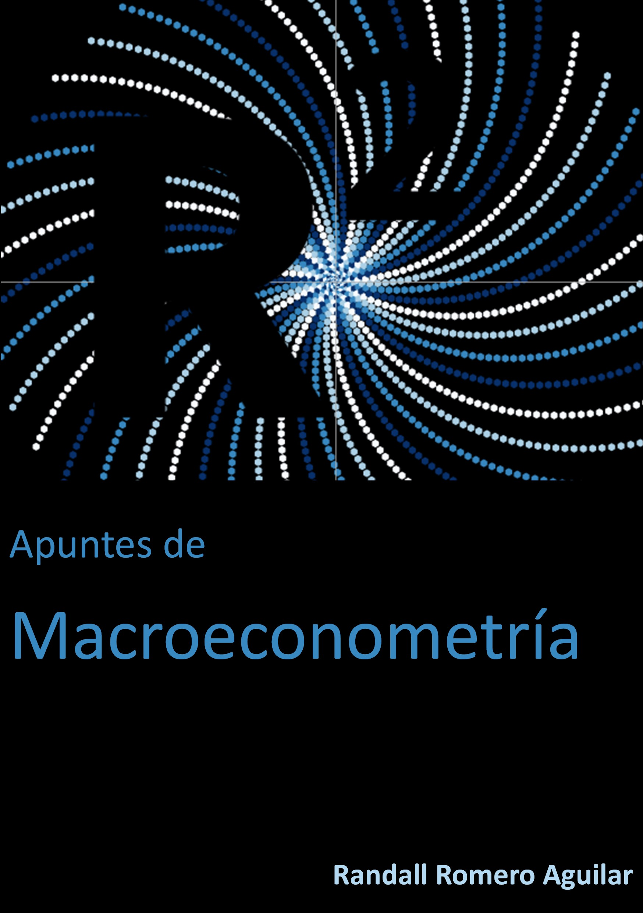

---
jupytext:
  formats: md:myst
  text_representation:
    extension: .md
    format_name: myst
kernelspec:
  display_name: Python 3
  language: python
  name: python3
substitutions:
  empieza_ejemplo: |
    <div class="ejemplo">
    <div class="ejemplo-titulo"><b>Ejemplo: &nbsp;
  fin_titulo_ejemplo: "</b></div>"
  termina_ejemplo: "</div>"
  empieza_test: |
    <div class="test">
    <div class="test-titulo">
  fin_titulo_test: "</div>"
  termina_test: "</div>"
  test_inquietud: |
    <i class="fas fa-question test-simbolo"></i>
  test_hipotesis: |
    <br><hr><i class="fas fa-heading test-simbolo"></i>
  test_estadistico: |
    <br><hr><i class="fas fa-calculator test-simbolo"></i>
  test_interpretacion: |
    <br><hr><i class="far fa-lightbulb test-simbolo"></i>
---



# Acerca de este libro

Este sitio muestra la versión preliminar de un libro de macroeconometría, basado en los apuntes del curso EC-4301 Macroeconometría, de la Universidad de Costa Rica.


Se asume que el lector ha tenido formación básica en estadística, econometría y en álgebra lineal.

```{div} example
En estos apuntes se presenta además varios ejemplos numéricos, bien sea con Stata o con Python.
```

```{warning}
Esta es apenas una versión preliminar de los apuntes del curso, que estaré actualizando a lo largo del primer semestre de 2021.
```
